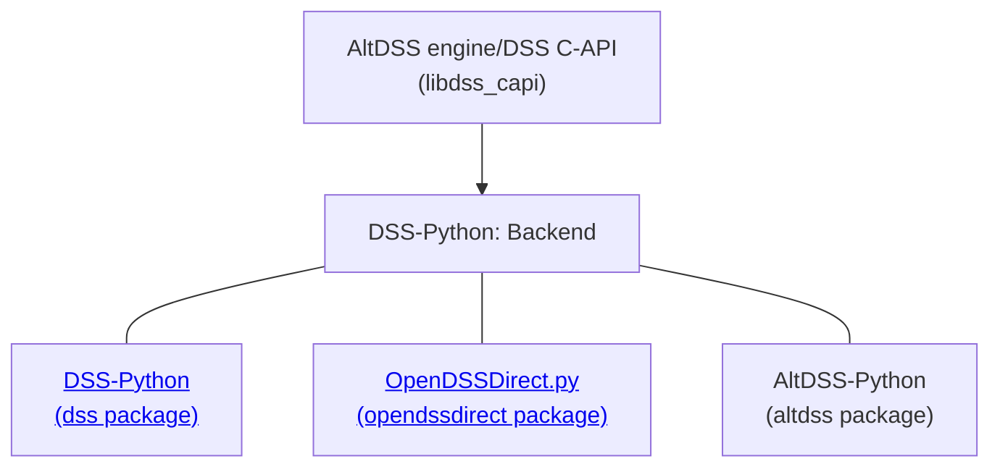

# AltDSS-Python

[](https://pypi.org/project/altdss/)   

AltDSS-Python, or just `altdss` when used from Python, builds on the DSS-Python backend infrastructure and experience shared in both DSS-Python and OpenDSSDirect.py to cover many aspects that the classic OpenDSS APIs (DSS-Python, OpenDSSDirect.py, official OpenDSS COM implementation, and anything based on the DCSL/OpenDSSDirect.DLL) cannot achieve comfortably or with good performance. Many features are only possible due to our alternative engine (AltDSS), used through the [AltDSS/DSS C-API](https://github.com/dss-extensions/dss_capi) library. 

This package is available for Windows, Linux and macOS, including Intel and ARM processes, both 32 and 64-bit. As such, it enables OpenDSS to run in many environments the official implementation cannot, from a Raspberry Pi to a HPC cluster, and cloud environments like Google Colab (some of our notebooks examples are ready-to-run on Colab).

AltDSS-Python is part of DSS-Extensions, a larger effort to port the original OpenDSS to support more platforms (OSs, processor architectures), programming languages, and extend both the OpenDSS engine and API, represented in the AltDSS engine:

<p align="center">
    
</p>

For alternatives for other programming languages, including in MATLAB, C++, C#/.NET, Rust and Go, please check [https://dss-extensions.org/](https://dss-extensions.org/) and our hub repository at [dss-extensions/dss-extensions](https://github.com/dss-extensions/dss-extensions) for more documentation, discussions and the [FAQ](https://github.com/dss-extensions/dss-extensions#faq).

<center>



</center>

AltDSS-Python is one of three Python projects under DSS-Extensions. See [DSS-Extensions — OpenDSS: Overview of Python APIs](https://dss-extensions.org/python_apis.html) for a brief comparison between these and the official COM API. Both OpenDSSDirect.py and DSS-Python expose the classic OpenDSS API (closer to the COM implementation). AltDSS-Python, on the other hand, exposes all OpenDSS objects, batch operations, and a more intuitive API. If required, users can mix all three packages in the same project to access some of their unique features, or just to avoid changing legacy/stable code.

Since the base code is shared, other features from [DSS-Python such as plotting](https://dss-extensions.org/DSS-Python/examples/Plotting.html) can be used here. Other examples from DSS-Python or OpenDSSDirect.py can be adapted quite easily too.

## What is AltDSS?

To avoid confusion between the official OpenDSS provided by EPRI and the alternative, unofficial implementation provided by the DSS-Extensions group of projects, our implementation of the OpenDSS engine, exposed as a software library (e.g. DLL or shared object), will be slowly renamed to AltDSS engine. The classic parts of our DSS C-API is still in place and will remain for usage in DSS-Python and OpenDSSDirect.py.

The "Alt" prefix tries to encompass a few aspects:
- An alternative implementation
- A new approach for the API
- A more searchable name (just "DSS" is too generic nowadays), and easier to cite.

What didn't change:
- It's the same engine that's been developed since 2018 on DSS-Extensions.
- Our cross-validation with the official OpenDSS implementation continues.
- If you have used DSS C-API, DSS-Python, DSS MATLAB, DSS Sharp, OpenDSSDirect.jl or OpenDSSDirect.py since 2018 or 2019 (depending on the package), you were already using "AltDSS".

If you somehow need compatibility with the official OpenDSS COM implementation at API level, prefer to stay with the classic API implementations such DSS-Python and OpenDSSDirect.py, and avoid anything marked as "API Extension". 

## What is AltDSS-Python?

AltDSS-Python is a new Python package that goes along with DSS-Python and OpenDSSDirect.py to provide a further Pythonic experience.

This new package uses many unique aspects of our alternative implementation of the engine and of the API to expose all types of DSS objects currently implemented in AltDSS.

When referring to Python, we will call AltDSS-Python just AltDSS, for short. The same will happen for other future language bindings based on the same concepts.

Notable features are:
- **All DSS objects** implemented in our implementation of the OpenDSS engine are exposed.
- Avoids the active element idiom. Users can interact with multiple objects without requiring to activate them.
- The original separate APIs for general circuit elements, PC elements, PD elements and others are encapsulated together with the access to the DSS properties in a single context. We hope to achieve a better autocomplete experience in IDEs and easier discoverability of the available functions. For example, a [`Line` object](altdss.Line.Line) contains all the DSS properties the the Line object (as Python properties), plus inherited methods/properties from common DSS objects, Circuit element objects, and PD element objects.
- Due to duplication, the access to the DSS properties replace many of the old COM-style properties. The names of the properties in Python that reflect the DSS properties are kept as close as possible. A few exceptions are names like `%Rs` (which is an invalid identifier in Python) that is exposed as `pctRs`. We hope that reusing the same names will reduce the cognitive load for the users and provide an easier transition between API and GUI (e.g. the main official OpenDSS GUI) usage. That is, a .DSS script is now closer to an AltDSS Python script and users shouldn't be required to learn two completely different conventions.
- More native types, including more extensive usage of Python enumerations and complex numbers.
- Batches! Manipulate batches of uniform objects (including DSS properties and general functions) or non-uniform collections of objects (general functions only, at the moment), with lower overhead.
- New dedicated EnergyMeter classes, including direct `MeterSection` inspection.

Note that the general interaction through .DSS scripts is unchanged and users can use AltDSS-Python together with DSS-Python or OpenDSSDirect.py since the engine is shared. That is, although it would be recommended to fully use AltDSS-Python when a v1.0 is done, there is no rush to migrate. Users can enjoy some of the new features piecewise, like batches or the APIs for all DSS object types not exposed in the classic APIs.

## Why a new package?

Besides the naming issue, although both DSS-Python and OpenDSSDirect.py acquired features since 2018, when DSS-Extensions was born, adding a lot of the features from AltDSS would break compatibility in a major way. Initially, more Pythonic and extra features were expected to land on OpenDSSDirect.py. Looking into the list of publications and public repositories using both packages suggests that breaking the API to introduce features is not advisable.

Moreover, many users still see OpenDSSDirect.py and think that it uses OpenDSSDirect.DLL. That is not the case, and even when it was (before August 2018), the Linux and macOS builds of OpenDSS were not supported by EPRI, the original OpenDSS developer. Effectively, OpenDSSDirect.py (OpenDSSDirect.jl is in a similar situation) never used an official binary on non-Windows platforms, since there is not any as of February 2024.

That said, we hope both new and experienced OpenDSS users find it easy to adopt it.

## Documentation

The documentation pages are organized as follows. This is a new project and the documentation is expected to be updated to include more examples soon. For now, we recommend checking at least the "Getting Started" guide.

```{toctree}
:maxdepth: 1
:caption: General
self
Architecture
examples/GettingStarted
Changelog <changelog>
```

```{toctree}
:maxdepth: 1
:caption: API Reference
General enums <enumerations>
altdss package <apidocs/index.rst>
```

```{toctree}
:maxdepth: 1
:hidden:
:caption: External links
GitHub repository <https://github.com/dss-extensions/AltDSS-Python>
Package on PyPI <https://pypi.python.org/pypi/altdss/>
Test/example circuits <https://github.com/dss-extensions/electricdss-tst>
DSS-Extensions/FAQ <https://github.com/dss-extensions/dss-extensions#faq>
OpenDSSDirect.py <https://dss-extensions.org/OpenDSSDirect.py>
DSS-Python <https://dss-extensions.org/DSS-Python/>
DSS-Extensions Discussions <https://github.com/orgs/dss-extensions/discussions>
OpenDSS forum <https://sourceforge.net/p/electricdss/discussion/>
OpenDSS documentation <https://opendss.epri.com/opendss_documentation.html>
```

